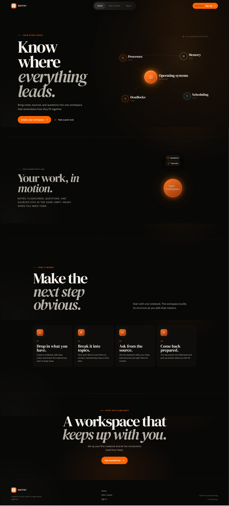
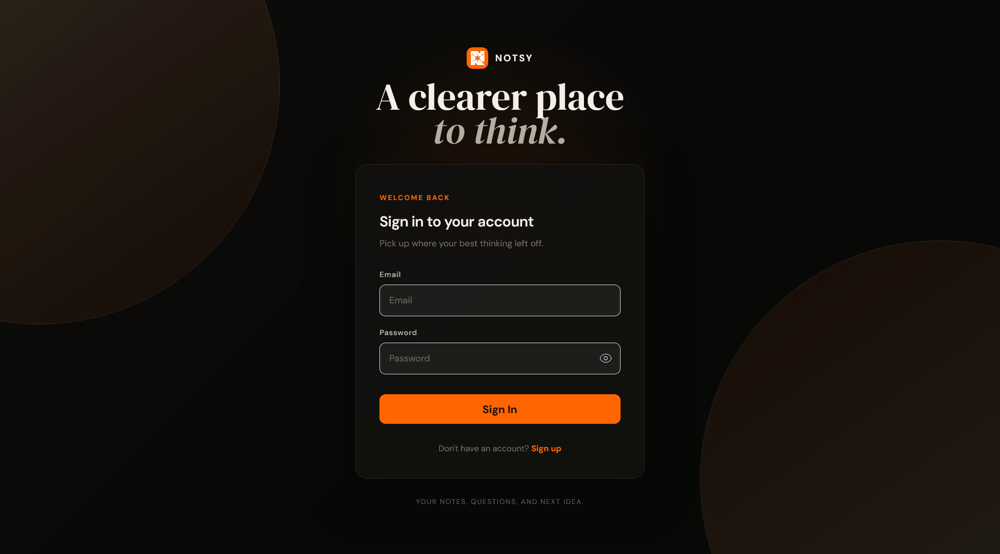
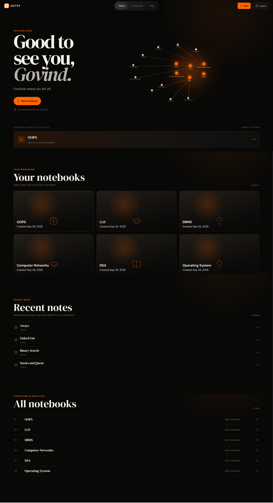
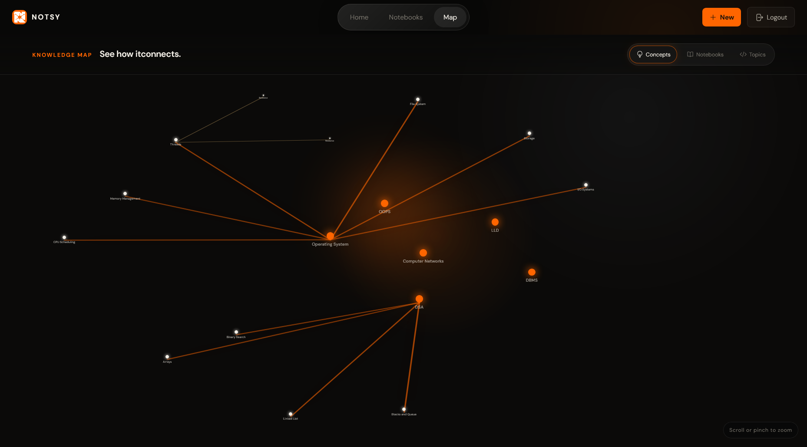
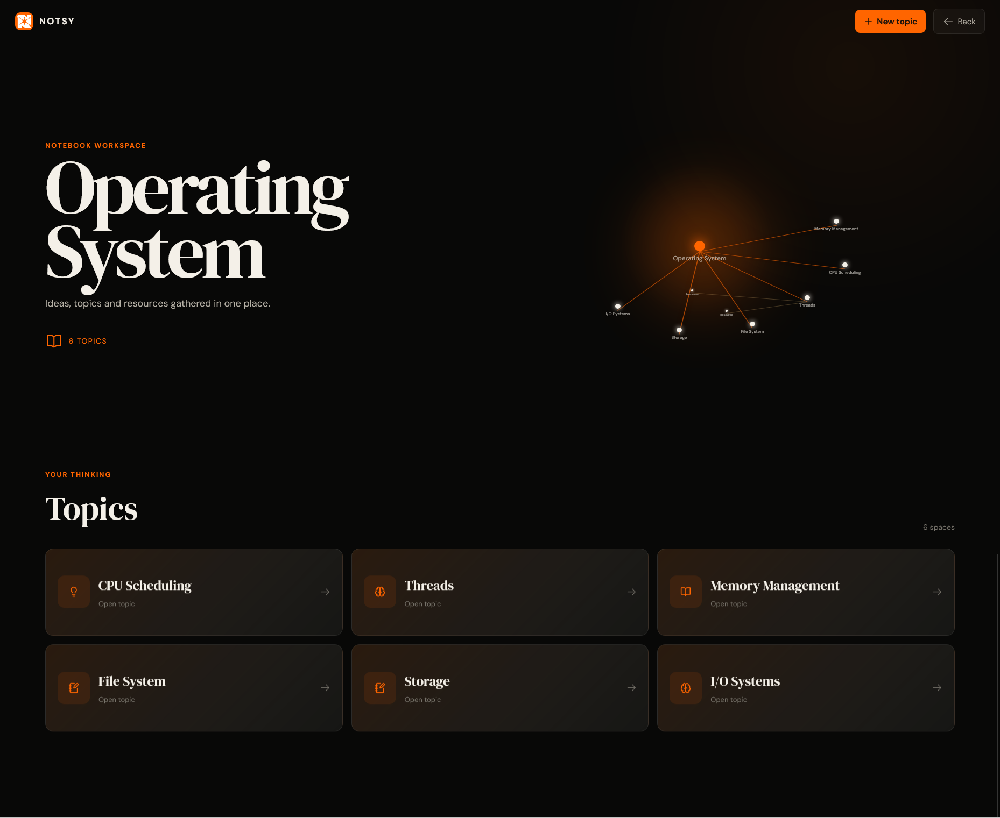
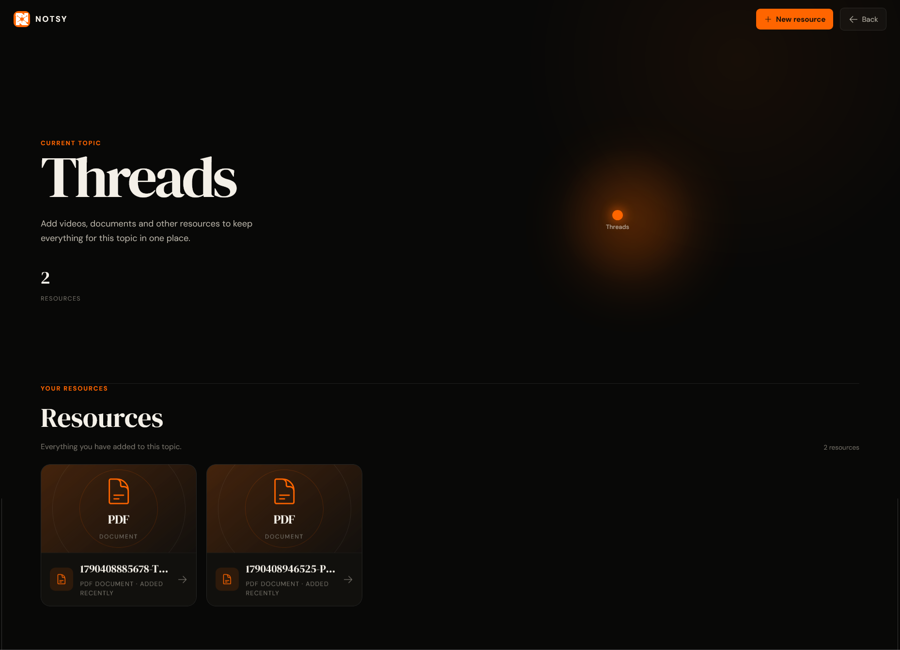
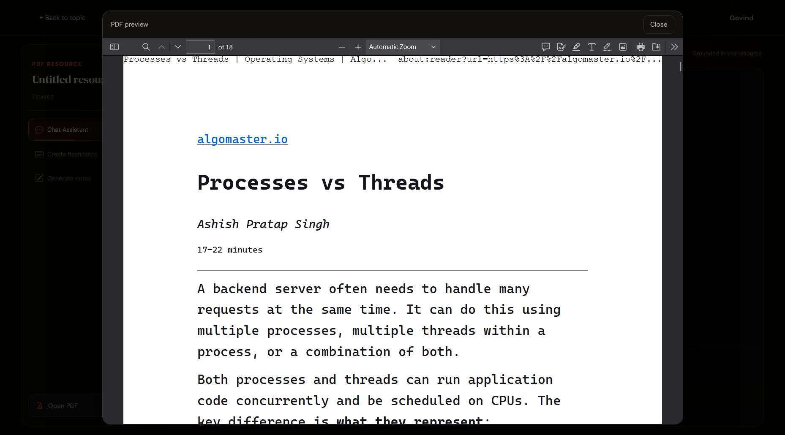
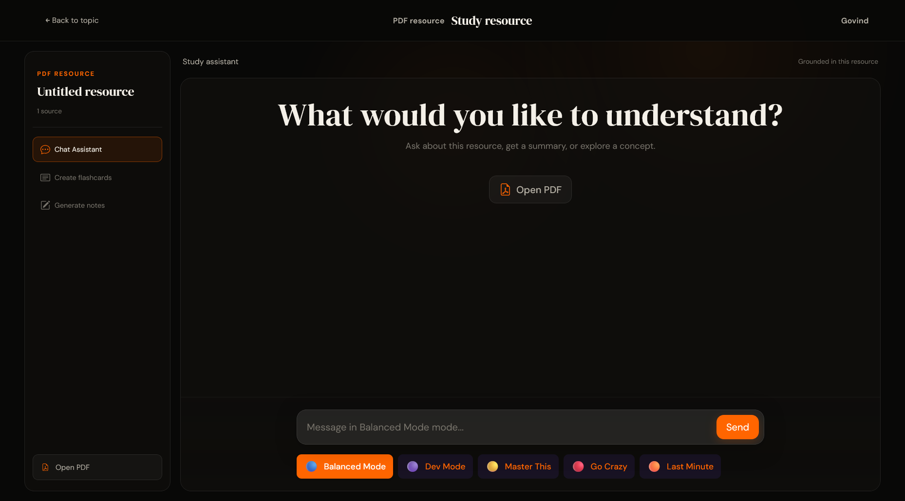

# Notsy

Notsy is a connected study workspace for collecting material, understanding it, and seeing how it fits together. Create notebooks, organise topics, attach PDFs or videos, then use the built-in study tools to chat with a resource, generate notes, make flashcards, and explore your knowledge map.

**Live website:** [Open Notsy](https://notsy-one.vercel.app/)

## Screenshots

### Landing page



### Login



### Dashboard



### Knowledge map



### Notebook workspace



### Topic workspace



### Resource preview



### Study chat



## What you can do

- Create notebooks and group related topics inside them.
- Add PDF documents and YouTube videos as topic resources.
- Open PDFs directly from the study workspace.
- Ask questions about a resource in the study chat.
- Generate revision notes and flashcards from your material.
- Explore notebooks, topics, and resources in an interactive constellation map.
- Move around the map with pan, zoom, selection, and cluster dragging.

## Tech stack

| Area                | Tools                                                                  |
| ------------------- | ---------------------------------------------------------------------- |
| Client              | React, Vite, React Router, Axios, Tailwind CSS, Headless UI            |
| API                 | Node.js, Express, Mongoose, JWT, Multer                                |
| Data                | MongoDB                                                                |
| Resource processing | Multer uploads, Puppeteer transcript extraction, Python PDF extraction |
| AI service          | Django/DRF, LangChain, Gemini, Pinecone                                |

## Project structure

```text
Notsy/
├── Frontend/                    # React + Vite application
│   ├── public/                  # Browser favicon
│   ├── src/
│   │   ├── assets/              # Images used by the application
│   │   ├── components/
│   │   │   ├── auth/            # Login and registration forms
│   │   │   ├── common/          # Shared confirmation dialog
│   │   │   ├── dashboard/       # Notebook overview and creation
│   │   │   ├── graph/           # Interactive knowledge map
│   │   │   ├── notebook/        # Topics within a notebook
│   │   │   ├── resource/        # Study workspace, notes and flashcards
│   │   │   └── topic/           # Resources and upload controls
│   │   ├── constants/           # Chat modes
│   │   ├── context/             # Authentication state
│   │   ├── hooks/               # Shared authentication hook
│   │   ├── layouts/             # Shared page layouts
│   │   ├── pages/               # Route-level screens
│   │   ├── routes/              # Router and protected routes
│   │   ├── services/            # API client and feature requests
│   │   ├── utils/               # Navigation and page caching
│   │   ├── App.jsx              # Providers and toast configuration
│   │   ├── index.css            # Global styles and design system
│   │   └── main.jsx             # Browser entry point
│   └── .env.example
├── Backend/                     # Express API
│   ├── config/                  # Upload configuration
│   ├── controllers/             # *.controller.js request handlers
│   ├── db/                      # MongoDB connection
│   ├── errors/                  # API error types
│   ├── middleware/              # JWT verification
│   ├── models/                  # *.model.js Mongoose schemas
│   ├── routes/                  # *.routes.js endpoint definitions
│   ├── services/                # Transcript extraction
│   ├── uploads/                 # Local runtime files; ignored by Git
│   ├── app.js                   # Server entry point
│   └── .env.example
├── notsy/                       # Django AI service
│   ├── ai/                      # Ingestion, retrieval and generation
│   ├── config/                  # Django settings and URL configuration
│   ├── manage.py
│   ├── requirements.txt
│   └── .env.example
├── docs/screenshots/            # README screenshots
├── scripts/                     # Repository structure checks
├── package.json                 # Convenience commands for both JS apps
└── README.md
```

Component names describe their screen or feature, such as `DashboardContent`,
`NotebookContent`, and `StudyWorkspace`. Backend filenames identify their role:
`notebook.controller.js`, `notebook.routes.js`, and `notebook.model.js`.

The service folder names are retained for existing deployment settings. The
notebook API still uses `/folder` and the MongoDB model remains `Folder` for
compatibility with existing clients and stored data.

## Run locally

### Prerequisites

- Node.js 22.12 or later and npm (Node.js 24 recommended)
- Python 3.10 or later (for AI-powered ingestion and generated notes)
- A MongoDB database (local MongoDB or MongoDB Atlas)

### 1. Configure the API

Install the backend dependencies:

```powershell
cd Backend
npm install
```

Create `Backend/.env` and add your own values:

```env
MONGO_URI=your_mongodb_connection_string
JWT_SECRET=your_secure_secret
JWT_LIFETIME=1d
FRONTEND_URL=http://localhost:5173
```

Start the API:

```powershell
npm run dev
```

The API runs on `http://localhost:3000` and serves uploads from `/uploads`.

### 2. Start the AI service

The API expects the AI service at `http://127.0.0.1:8000` for ingestion, chat, notes, and flashcards. Copy `notsy/.env.example` to `notsy/.env` and configure your Gemini key and Pinecone index.

```powershell
cd notsy
python -m venv .venv
.venv\Scripts\Activate.ps1
pip install -r requirements.txt
python manage.py runserver 8000
```

### 3. Start the client

Copy `Frontend/.env.example` to `Frontend/.env`. In another terminal:

```powershell
cd Frontend
npm install
npm run dev
```

Open the Vite address shown in the terminal (normally `http://localhost:5173`).

## Useful scripts

| Location   | Command                | Purpose                                                   |
| ---------- | ---------------------- | --------------------------------------------------------- |
| `Frontend` | `npm run dev`          | Run the development client                                |
| `Frontend` | `npm run build`        | Create a production client build                          |
| `Frontend` | `npm run lint`         | Check client code with ESLint                             |
| `Backend`  | `npm run dev`          | Run the API with automatic restarts                       |
| `Backend`  | `npm start`            | Run the API normally                                      |
| Root       | `npm run dev:frontend` | Start the frontend from the repository root               |
| Root       | `npm run dev:backend`  | Start the backend from the repository root                |
| Root       | `npm run build`        | Build the frontend                                        |
| Root       | `npm run check`        | Check local imports, backend syntax, and screenshot links |

## Configuration notes

- The frontend API base URL is configured with `VITE_API_URL`; the local template uses `http://localhost:3000/notsy`.
- CORS origins are configured with `FRONTEND_URL`; the local template includes `http://localhost:5173`.
- Install dependencies within `Frontend/` and `Backend/`. Each application has its own committed lockfile; the root package only provides convenience commands.
- Dependencies, uploaded files, local databases, and environment files are excluded from Git. Screenshots belong in `docs/screenshots/`, not the frontend asset bundle.
- Never commit `.env` files or API keys.
- For MongoDB Atlas, add your current IP address to the Atlas network access list. A connection error such as `ReplicaSetNoPrimary` or a TLS alert often means Atlas access, DNS, or network rules need checking.

## Deploying to Vercel and Render

The frontend must never use `localhost` after deployment: a visitor's browser treats `localhost` as its own device, not your Render API.

1. Deploy `Backend/` to Render and confirm its public **HTTPS** URL responds.
2. In the Vercel project, add `VITE_API_URL` with the complete API base URL, for example `https://your-api.onrender.com/notsy`.
3. In the Render service, add `FRONTEND_URL=https://notsy-one.vercel.app`. Add more origins with commas if you use Vercel preview domains.
4. Redeploy Render after changing its environment variables, then redeploy Vercel. Vite embeds `VITE_*` variables during the build.

Use the provided [Frontend/.env.example](Frontend/.env.example) and [Backend/.env.example](Backend/.env.example) as safe configuration templates. Do not include a trailing slash in `VITE_API_URL`.

## Product flow

1. Sign up and create a notebook.
2. Add topics to keep ideas focused.
3. Attach PDFs or videos as study resources.
4. Open a resource to chat, create flashcards, or generate notes.
5. Use the knowledge map to see and navigate the relationships between your work.

---

Built for quieter, more connected learning.
